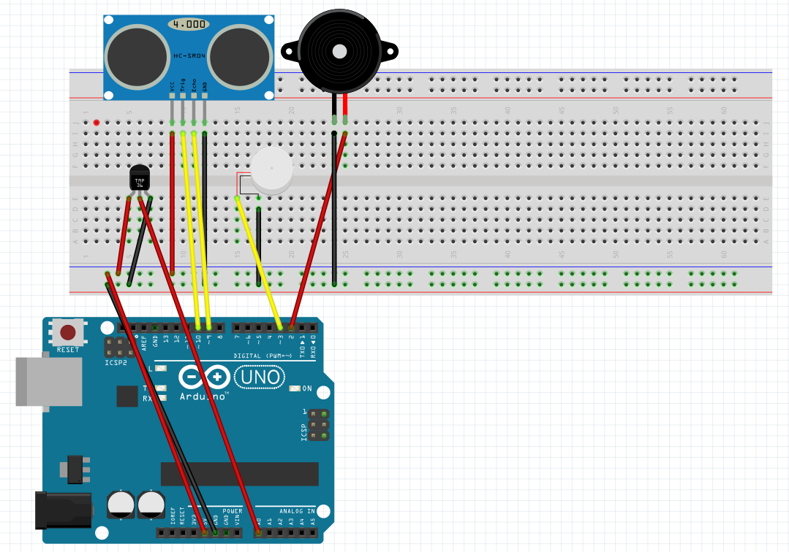

# VisionTouch Gloves For Blind People 
## Area of Focus: Healthcare 
The VisionTouch Gloves project aims to revolutionize safety for visually impaired individuals by integrating cutting-edge technology into wearable devices. Utilizing an Arduino Uno, ultrasonic sensor, piezoelectric buzzer, DHT11 temperature sensor, and a vibrator motor, the gloves provide real-time obstacle detection, audible alerts, and haptic feedback. The innovative feature activates the vibrator motor when an object's temperature exceeds 40 degrees Celsius, preventing potential burns. The project envisions empowering visually impaired users to navigate their surroundings safely, addressing critical healthcare concerns in accessibility and safety. 
## Project Goals and Methodologies: 
The primary goal of the VisionTouch Gloves is to enhance the safety and independence of visually impaired individuals. Through the integration of advanced sensors and actuators, the gloves detect obstacles, provide audible warnings, and offer haptic feedback to the user. The inclusion of a temperature sensor adds an extra layer of safety, preventing users from inadvertently touching hot surfaces. Methodologies include sensor integration, Arduino programming, and wearable technology design. 
## Expected Outcomes: 
- Real-time obstacle detection for enhanced navigation. 
- Audible alerts and haptic feedback for immediate awareness. 
- Activation of the vibrator motor to prevent burns from hot objects. 
- Improved safety and independence for visually impaired users. 
## Visual Representation: 

## Components and cost 
- Arduino Uno: ₹650 
- Ultrasonic Sensor (HC-SR04): ₹150 
- Piezoelectric Buzzer: ₹50 
- DHT11 Temperature Sensor: ₹120 
- Vibrator Motor: ₹150  Gloves: ₹480 
- Jumper Wires and Breadboard:₹500 
- Usb Type A to B Cable:₹200 
- Total cost:₹2300 
## Limitations and Challenges: 
While the VisionTouch Gloves present a significant advancement, challenges include optimizing power consumption for prolonged use, ensuring accurate temperature sensing, and addressing any limitations in obstacle detection. The project is continually evolving to overcome these challenges and provide an effective and reliable solution for the visually impaired community. 
#### Submitted by : 
- Hisham Raihan(URK23CS1028) 
- Enem Barjo (URK23CS1015) 
##### Computer organization and architecture -23CS1012 
Faculty : Dr.Naveen Sundar